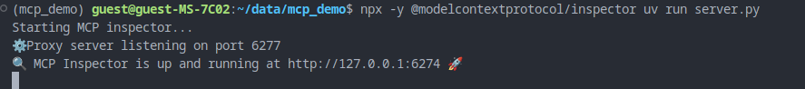
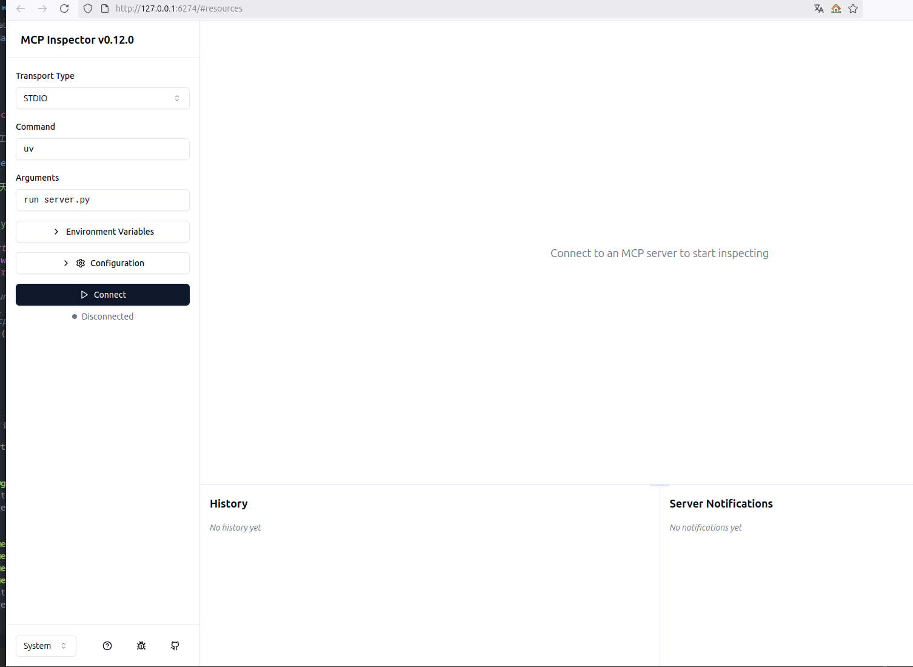
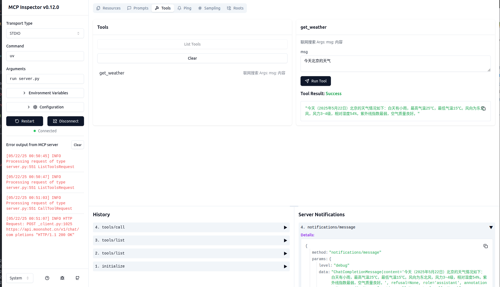
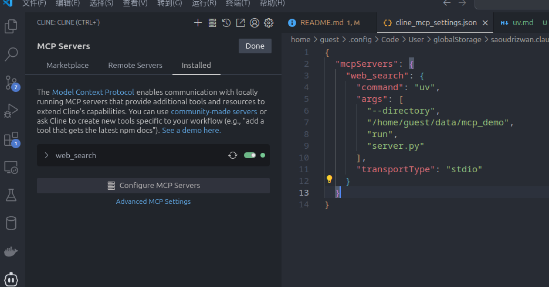
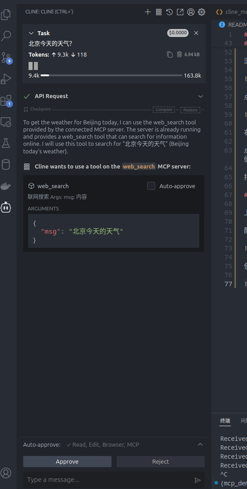
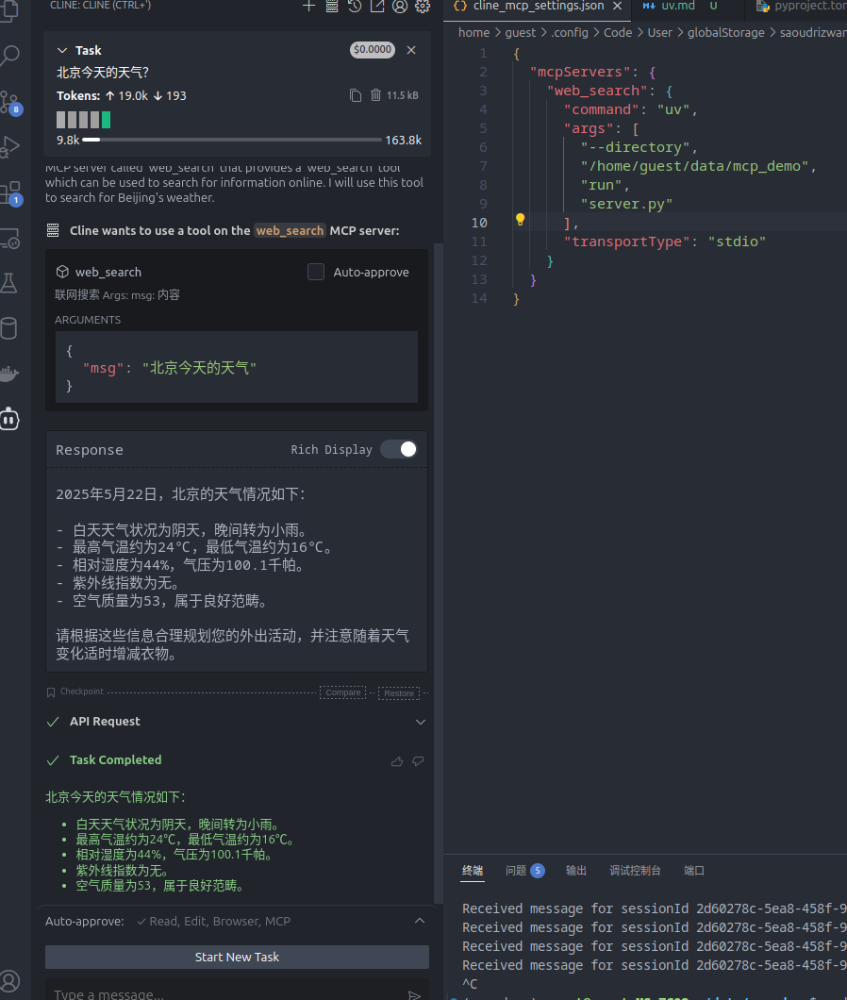
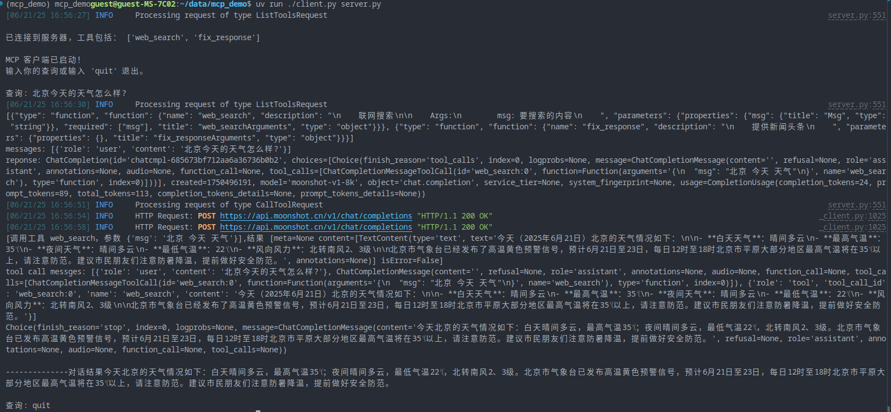
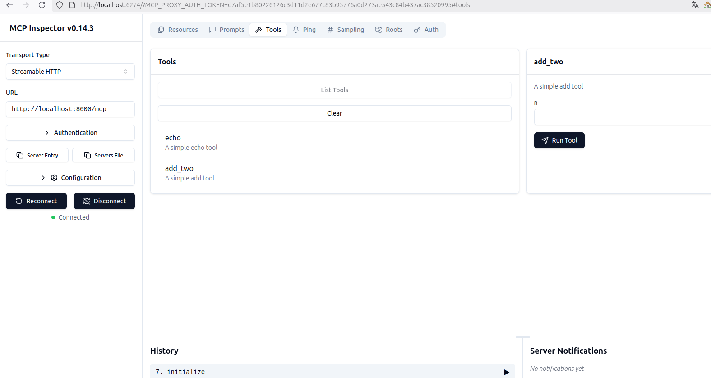

# MCP入门

## 概念

- LLM端：大模型，比如我们用`deepseek`，`kimi`聊天，这些就是大模型端。
- mcp服务器：和我们通常概念里面的服务器是一个意思，通常我们的服务器是运行在远端的，比如阿里云的云主机上面，不间断的对外提供服务。
mcp服务器对外是提供MCP协议相关的服务。
- mcp客户端：客户端充当一个大模型和mcp服务器之间的一个桥梁，客户端把所有自己知道的mcp服务器分类好整理好变成一个工具列表提交给大模型，大模型发现有自己不能完成的任务的时候，就会去这个工具列表里面查找，如果找到就会通知客户端去调用大模型指定的工具，客户端再把调用结果和用户输入重新提交给大模型，大模型处理后发给用户。

## 准备工作

python版本>=3.12。

安装`uv`工具，`uv`是一个python的包管理工具。

安装`node`，用来运行调试工具。

创建项目：

```bash
#创建项目目录
mkdir mcp_demo
#导航到项目根目录
cd mcp_demo
#初始化项目目录
uv init
#或 下面两条命令和上面三条一样
uv init mcp_demo
cd mcp_demo

#创建虚拟环境并激活
uv venv
source .venv/bin/activate

#安装依赖
uv add "mcp[cli]" httpx openai
```

## 服务器端

创建一个文件`server.py`，我们把mcp服务器的代码都写在里面。

关键要点：

- 创建服务器实例：`mcp = FastMCP("weather")`
- 用装饰器创建tool工具：`@mcp.tool()`
- 最后在main里面运行起来：`mcp.run(transport='stdio')`

为了方便例子里面使用的`kimi`的`web_search`功能来获取实时外部数据。

可以按需替换成自己方便获取实时数据的方式，比如调用付费的搜索api接口等。

## 调试

先执行`uv run server.py`看下程序有没有问题。

然后我们用`inspector`来调试，运行下面的命令：

`npx -y @modelcontextprotocol/inspector uv run server.py`



浏览器打开`http://127.0.0.1:6274`。



左侧`Transport Type`选`STDIO`, 点击`connect`，连接成功会有个绿色的点提示。



右侧顶部切换到`Tools` => `List Tools`，然后下面就会列出`web_search`工具了。

点击`web_search`，最右侧出现输入框，输入我们的搜索的内容，点击`Run Tool`按钮就会执行我们写的工具了，结果会输出在按钮下方。

打印的日志会出现在下面的`Server Notifications`里面。

## 在Cline里面使用

上面编写的`web_search`调试好没问题后，可以配置到vscode的Cline插件里面使用。

配置：



使用：输入问题`北京今天的天气？`：



它提示我们需要使用`web_search`来获取实时数据，点击下面的`approve`按钮同意执行。



Cline最终把mcp server的响应和大模型的总结都输出来了。

## 编写客户端

上面是放在Cline里面运行，因为Cline里面已经包含了MCP客户端实现。

客户端的功能是把配置启用了的mcp server信息都收集起来，发送给大模型，大模型发现有自己不知道的信息的时候，就会通知客户端去调用mcp server去获取。

调用哪个mcp服务器和参数都是大模型决定的，客户端只是执行的角色，相当于一个中间层，把mcp服务器和大模型连接了起来。

`uv run ./client.py server.py`



上图最下面虚线部分是一次对话的最终结果。

## 其他MCP服务器功能

工具（tool）是用的比较多的MCP服务器功能，还有一些其他类型的功能可用：

### resource 资源

资源是指可以公开给LLM的数据和内容，可以是任意类型的数据。

比如：

- 文件内容
- 图像内容
- 日志文件
- 等等......

资源是用URI来标识的，比如：

- 本地文件：`file:///home/user/documents/report.pdf`
- 数据库： `postgres://database/customers/schema`

URI里面的协议和路径由MCP服务器自己实现定义。

客户端需要使用资源的时候用URI发起`read`请求来读取资源的内容。

### prompt 提示

提示则是预定义的一些提示词，可以是动态的，也可以是静态的。

### simping 采样

采样则是服务器通过客户端请求LLM补全内容。

客户端可以对请求和结果进行审核和修改。

这里的服务器指的是通常的应用服务器，比如聊天机器人，数据分析系统。

客户端可以是自定义的或者是MCP客户端。

客户端相当于是一个代理，应用系统不能直接访问LLM而是需要通过客户端来访问，客户端可以对请求和响应内容做控制，从而达到保护数据安全和隐私的作用,主要是可控的交互。

## 传输层

上面示例MCP客户端和服务器之间的通信是通过标准输入输出来进行的，还有另一种传输方式HTTP。

工作模式：

- 客户端到服务器：Http POST JSON-RPC消息
- 服务器响应：可以是简单的JSON数据或者SSE数据流

示例：

启动服务器：`uv run server_stream.py`，会提示监听在`8000`端口。

然后启动`inspector`调试：`npx -y @modelcontextprotocol/inspector`。

如果需要token访问，`inspector`会打印在控制台，直接复制控制台的链接访问即可。



客户端访问服务器默认的地址路径是`/mcp`，所以访问URL是`http://localhost:8000/mcp`。

自定义客户端连接：`uv run client_stream.py`
